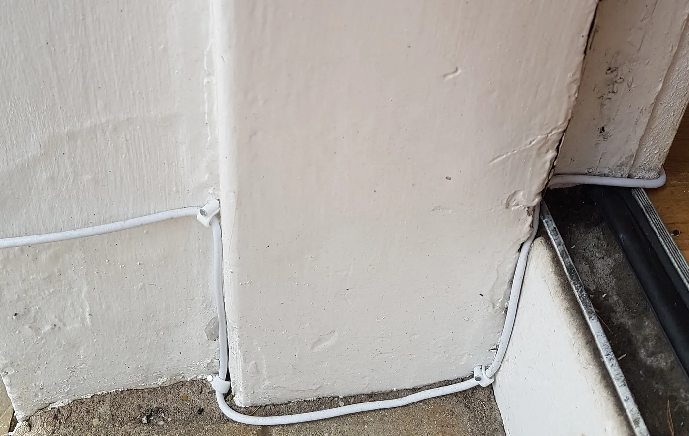
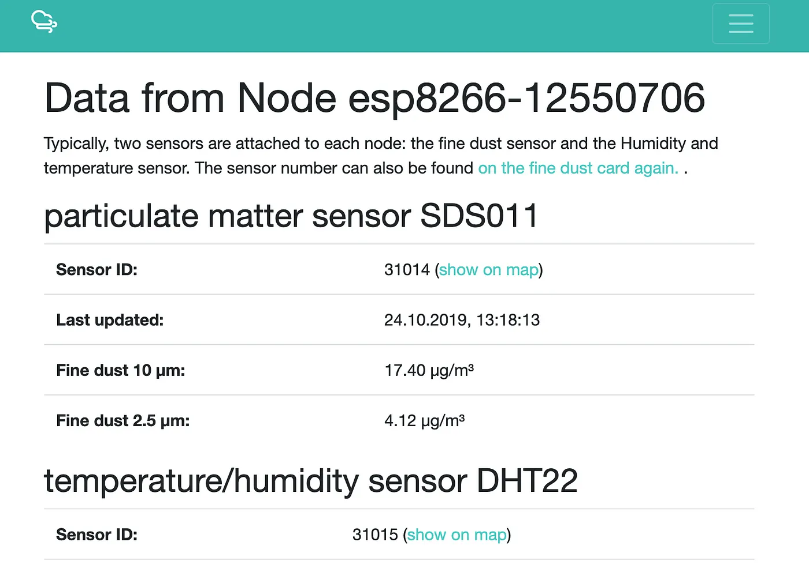

+++
title = 'Building a DIY Pollution Monitor'
date = 2019-10-24T13:10:20+01:00
draft = false
+++

For over ten years I lived in London. I _love_ the city but time passed, I became a father and I also became suddenly—painfully—aware of the impact of what living in such a big city could be having on my children. It bugged me. In any case, we moved away from London to Glasgow a couple of years ago. I realised, putting the kids to bed one evening, that there was a constant stream of traffic on the road outside the window. It seems that our road is a rush-hour rat run. The thought was triggered again—what effect could this be having on our health? Shortly after this I was in Germany where I heard about [Sensor.Community](https://sensor.community/en/) and it piqued my attention. Here was a project set up to try and get a better picture of the quality of air around the world. I looked through their site —building an air pollution monitor looked like _fun_. This is something I wanted to get involved with.

I ordered the electronic components detailed in the construction manual and counted the days until the parcels arrived. I'd done some tinkering with electronics as a teenager but very little since that time. Having the parcels eventually arrive felt a bit like Christmas. I got stuck in (from this point forward, I'm using the instructions on the [Sensor.Community](https://sensor.community/en/) site rather than copying them verbatim into this post).

The first thing that I wanted to do was just to see something—anything—being detected via the temperature and PM (particulate matter) sensors.

## Putting the firmware on the CPU
The NodeMCU ESP8266 chip communicates all the data gathered by the sensors to the outside world. I imported the firmware onto the chip first, again using the construction notes from the [Sensor.Community](https://sensor.community/en/) site. I learnt a fair bit about how to use USB serial drivers to send information from my Mac laptop to this bare-bones chip—it was an education. It took an hour or so, but eventually I had a chip speaking to my home Wi-Fi network. It wasn't actually doing anything yet, though. This was the next step

## Connecting the sensors
There are two sensors connected to the NodeMCU. The SDS011 particulate matter sensor records levels of particulate matter in the air whilst the DHT22 provides information about temperature and air moisture. I continued with the construction notes and hooked up the sensors with the NodeMCU. I used sleeve connectors to hook up the sensors with the NodeMCU—in theory this could also have been done in a more permanent way with a soldering iron. One for a future build, perhaps. Once all of this was completed, I now had a functioning sensor. All I needed to do was to connect the NodeMCU to a 5V power source. A micro USB connector did the trick for me—one I used to use for charging up my mobile phone. On the first attempt, I could see an LED flashing on the NodeMCU, but I couldn't hear the SDS011 sensor powering up to do its readings. I checked the connections again and the SDS011 sensor did power up—perhaps there is a logic to using a soldering iron for more persistent connections.

## Checking out the data
The firmware on the NodeMCU includes a web interface where it's possible to send data points both to [Sensor.Community](https://sensor.community/en/) and also to [OpenSenseMap](https://opensensemap.org/explore/5d6b690f953683001a560b8b). There's also the option to send to your own API endpoint which could be useful if you wanted to trap the data for your own purposes. All the endpoints mentioned above assume that the sensors are working, weather-proofed and mounted outside and are therefore recording useful data. This wasn't the case for me at this point, though—I just wanted to see that data was actually being recorded. To test this, I could verify what was happening at the endpoints for [particulate matter](https://www.madavi.de/sensor/graph.php?sensor=esp8266-12550706-sds011) and [temperature/humidity levels](https://www.madavi.de/sensor/graph.php?sensor=esp8266-12550706-dht). Everything was working! The next step was to work out how to get things mounted and recording outside.

## Protecting the sensors from the elements
I spent _way_ too long trying to source [the housing recommended by the Sensor.Community project](https://www.bauhaus.info/ht-rohre/ht-bogen/p/13625028) without the hefty shipping costs but couldn't quite find anything similar in the UK. I decided to use a junction box which seemed to blend in nicely with the front of the house which should provide adequate protection from the elements. One downside to using the junction box was that the exact temperature readings could be affected by not having a free flow of air going through the housing. As a result I removed one of the access points and placed a gauze over the hole so that air could enter the housing. I imagine that there may be some inconsistency in readings given that the heat of the other components in the box may impact on the temperate, though. This can be seen in the diagram below.

The next step was placing all the elements into the box.

I'd chosen to put the box outside the front of the house 1.5 metres above ground level—roughly the height of a child's head. The main road is roughly 9 metres from my house. I'm not concerned about vandalism otherwise I would probably have considered placing it in a more inaccessible location.

Fitting everything into the box was relatively straightforward. There was enough space for all the sensors and the chips and I made a point of making sure that the signal to the NodeMCU Wi-Fi chip was unimpeded. The image to the left shows the temperature/moisture sensor placed on top of the gauze. There is a free flow of air to the sensor. I secured the lid to the junction box and then began running the micro USB cable into the house.

## Running the micro USB cable into the house

I had considered drilling a hole through the front of the house so that I would only have needed a short length of USB cabling. In the end the lack of a long enough drill bit put me off this, so I bought [an extra-long micro USB cable](https://www.amazon.co.uk/dp/B07JZ1WZ53) with the intention of running this through a window or via the front door. In the end I went via the front door—there was enough of a gap for me to run the cable along the base of the outside wall, through the front door and into the kitchen. A few cable clips along the way and the installation is barely noticeable. I've checked for any wear on the cable where is crosses the threshold and everything seems fine.

## Go live
Everything was now in place. I could see from the [feeds on madavi.de](https://api-rrd.madavi.de:3000/grafana/d/GUaL5aZMz/pm-sensors?orgId=1&theme=light&var-chipID=esp8266-12550706) that data was still being passed so the final part of the puzzle was to register my new sensor. Having taken a note of my unique sensor ID [I registered my sensor with Sensor.Community](https://meine.luftdaten.info/sensors/15662/data). Done! The first Sensor.Community sensor in Glasgow, no less.

## Getting set up with openSenseMap
I'd noted that there was a similar open data project at [openSenseMap](https://opensensemap.org/). I registered, configured everything using both the local sensor interface and help provided on openSenseMap and before I knew it I was now also registering information here, too. [Here's my openSenseMap feed](https://opensensemap.org/explore/5d6b690f953683001a560b8b).

## What the data said
I was almost immediately able to view air quality levels outside the front of my house. I could see that the PM levels, on average, were pretty low. Although there were some spikes during rush-hour traffic there was nothing which seemed to be of concern. There were _some_ spikes, especially during the quiet night hours which I couldn't quite understand—dust in the air, perhaps?

## The future
I'd love to build more of these sensors. Some thoughts about what I could do next:

- Getting in touch with my children’s school to see if they'd like to build one of these sensors as a class project
- Running a sensor off solar power. I read [a post by Achim Tack about a sensor he built](https://www.achim-tack.org/blog/2017/5/27/my-airrohr-a-solar-powered-fine-dust-sensor)—pretty inspiring.
- Putting a sensor on the back of my bicycle and monitoring pollution levels around the city
